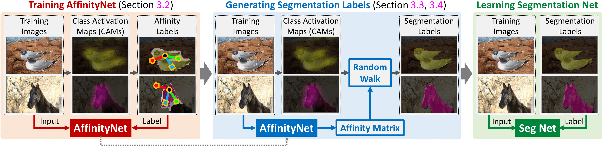

# Learning Pixel-level Semantic Affinity with Image-level Supervision


## Introduction

The code and trained models of:

Learning Pixel-level Semantic Affinity with Image-level Supervision for Weakly Supervised Semantic Segmentation, Jiwoon Ahn and Suha Kwak, CVPR 2018 [[Paper]](https://arxiv.org/abs/1803.10464)

We have developed a framework based on AffinityNet to generate accurate segmentation labels of training images given their image-level class labels only. A segmentation network learned with our synthesized labels outperforms previous state-of-the-arts by large margins on the PASCAL VOC 2012.

>*We are preparing to release the full [code](https://github.com/jiwoon-ahn/irn) of our follow-up CVPR 2019 paper of this project. This will include a more efficient and effective module for semantic propagation, and much more! **Hence, this repository will be deprecated.**

>*Our code was first implemented in Tensorflow at the time of CVPR 2018 submssion, and later we migrated to PyTorch. Some trivial details (optimizer, channel size, and etc.) have been changed.

## Citation
If you find the code useful, please consider citing our paper using the following BibTeX entry.
```
@InProceedings{Ahn_2018_CVPR,
author = {Ahn, Jiwoon and Kwak, Suha},
title = {Learning Pixel-Level Semantic Affinity With Image-Level Supervision for Weakly Supervised Semantic Segmentation},
booktitle = {The IEEE Conference on Computer Vision and Pattern Recognition (CVPR)},
month = {June},
year = {2018}
}
```

## Prerequisite
* Tested on Ubuntu 16.04, with Python 3.5, PyTorch 0.4, Torchvision 0.2.1, CUDA 9.0, and 1x NVIDIA TITAN X (Pascal).
* [The PASCAL VOC 2012 development kit](http://host.robots.ox.ac.uk/pascal/VOC/voc2012/):
You also need to specify the path ('voc12_root') of your downloaded dev kit.
* (Optional) If you want to try with the VGG-16 based network, PyCaffe and VGG-16 ImageNet pretrained weights [[vgg16_20M.caffemodel]](http://liangchiehchen.com/projects/Init%20Models.html)
* (Optional) If you want to try with the ResNet-38 based network, Mxnet and ResNet-38 pretrained weights [[ilsvrc-cls_rna-a1_cls1000_ep-0001.params]](https://github.com/itijyou/ademxapp)

## Usage
#### 1. Train a classification network to get CAMs.

```bash
python3 train_cls.py --lr 0.1 --batch_size 16 --max_epoches 15 --crop_size 448 --network [network.vgg16_cls | network.resnet38_cls] --voc12_root [your_voc12_root_folder] --weights [your_weights_file] --wt_dec 5e-4
```

#### 2. Generate labels for AffinityNet by applying dCRF on CAMs.

```bash
python3 infer_cls.py --infer_list voc12/train_aug.txt --voc12_root [your_voc12_root_folder] --network [network.vgg16_cls | network.resnet38_cls] --weights [your_weights_file] --out_cam [desired_folder] --out_la_crf [desired_folder] --out_ha_crf [desired_folder]
```


#### (Optional) Check the accuracy of CAMs.
```bash
python3 infer_cls.py --infer_list voc12/val.txt --voc12_root [your_voc12_root_folder] --network network.resnet38_cls --weights res38_cls.pth --out_cam_pred [desired_folder]
```


#### 3. Train AffinityNet with the labels

```bash
python3 train_aff.py --lr 0.1 --batch_size 8 --max_epoches 8 --crop_size 448 --voc12_root [your_voc12_root_folder] --network [network.vgg16_aff | network.resnet38_aff] --weights [your_weights_file] --wt_dec 5e-4 --la_crf_dir [your_output_folder] --ha_crf_dir [your_output_folder]
```

#### 4. Perform Random Walks on CAMs

```bash
python3 infer_aff.py --infer_list [voc12/val.txt | voc12/train.txt] --voc12_root [your_voc12_root_folder] --network [network.vgg16_aff | network.resnet38_aff] --weights [your_weights_file] --cam_dir [your_output_folder] --out_rw [desired_folder]
```

## Results and Trained Models
#### Class Activation Map

| Model         | Train (mIoU)    | Val (mIoU)    | |
| ------------- |:-------------:|:-----:|:-----:|
| VGG-16        | 48.9 | 46.6 | [[Weights]](https://drive.google.com/file/d/1Dh5EniRN7FSVaYxSmcwvPq_6AIg-P8EH/view?usp=sharing) |
| ResNet-38     | 47.7 | 47.2 | [[Weights]](https://drive.google.com/file/d/1xESB7017zlZHqxEWuh1Rb89UhjTGIKOA/view?usp=sharing) |
| ResNet-38     | 48.0 | 46.8 | CVPR submission |

#### Random Walk with AffinityNet

| Model         | alpha | Train (mIoU)    | Val (mIoU)    | |
| ------------- |:-----:|:---------------:|:-------------:|:-----:|
| VGG-16        | 4/16/32 | 59.6 | 54.0 | [[Weights]](https://drive.google.com/file/d/10ue1B20Q51aQ53T93RiaiKETlklzo4jp/view?usp=sharing) |
| ResNet-38     | 4/16/32 | 61.0 | 60.2 | [[Weights]](https://drive.google.com/open?id=1mFvTH3siw0SS0vqPH0o9N3cI_ISQacwt) |
| ResNet-38     | 4/16/24 | 58.1 | 57.0 | CVPR submission |

>*beta=8, gamma=5, t=256 for all settings
